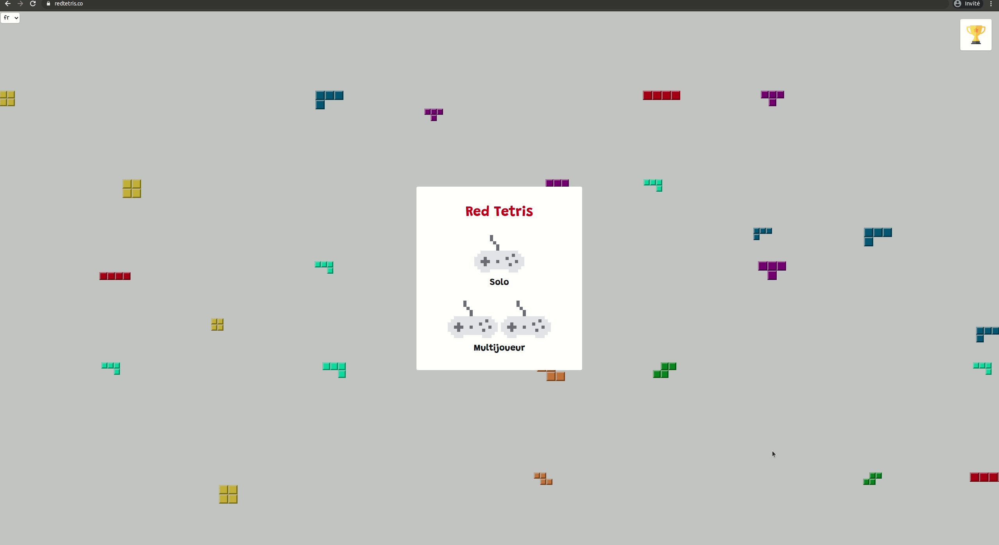
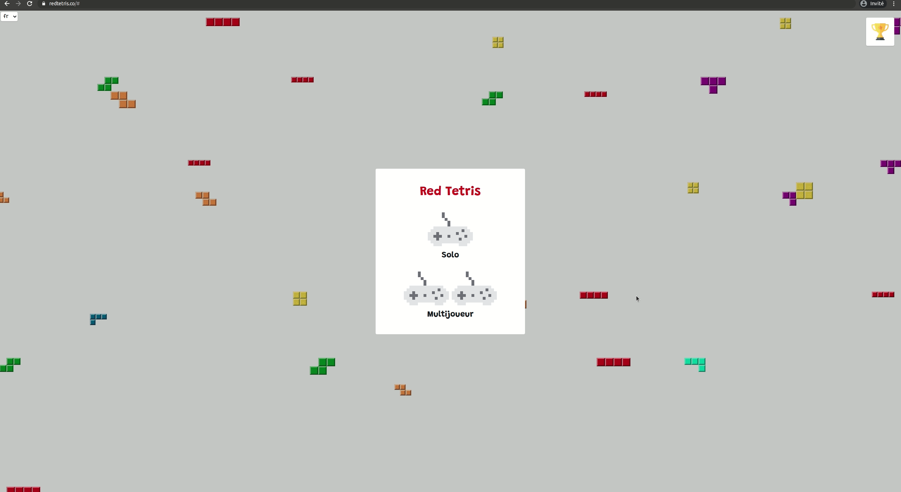

<!-- ALL-CONTRIBUTORS-BADGE:START - Do not remove or modify this section -->

<!-- ALL-CONTRIBUTORS-BADGE:END -->

# Red Tetris

A JavaScript Full Stack project to recreate an online Tetris game.

## Demo 💻

Online demo available here : https://redtetris.co
   
<table>
  <tdr>
    
  </tr>
  <tr>
    
  </tr>
</table>

## Documentation 📄

See [documentation](./docs/README.md).

## Contributors ✨

Thanks goes to these wonderful people ([emoji key](https://allcontributors.org/docs/en/emoji-key)):

<!-- ALL-CONTRIBUTORS-LIST:START - Do not remove or modify this section -->
<!-- prettier-ignore-start -->
<!-- markdownlint-disable -->
<table>
  <tr>
    <td align="center"><a href="https://fr.linkedin.com/in/nicolasvienot"> <b>Nicolas Viénot</b></a> <a href="https://github.com/jeremie-gauthier/Red-Tetris/commits?author=nicolasvienot" title="Code">💻</a></td>
    <td align="center"><a href="https://jeremie-gauthier.github.io/"> <b>jergauth</b></a> <a href="https://github.com/jeremie-gauthier/Red-Tetris/commits?author=jeremie-gauthier" title="Code">💻</a></td>
  </tr>
</table>

<!-- markdownlint-enable -->
<!-- prettier-ignore-end -->
<!-- ALL-CONTRIBUTORS-LIST:END -->

This project follows the [all-contributors](https://github.com/all-contributors/all-contributors) specification. Contributions of any kind welcome!
